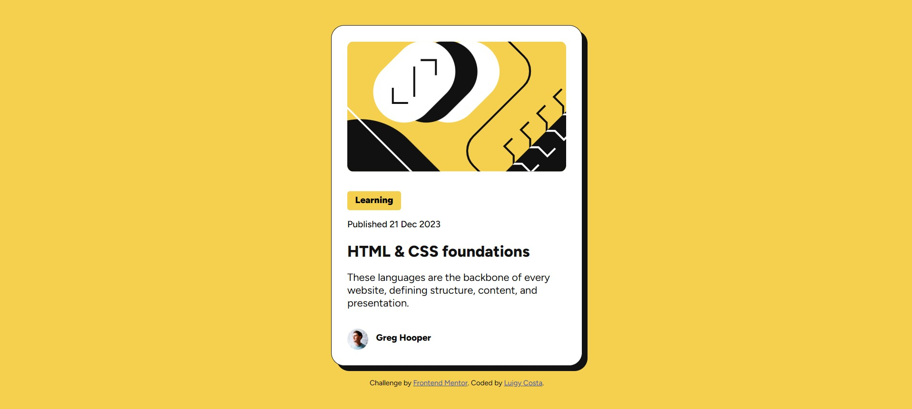

# Mentor Frontend - Blog Preview Card Solution

This is a solution to the [blog preview card challenge on Mentor Frontend](https://www.frontendmentor.io/challenges/blog-preview-card-ckPaj01IcS). Mentor Frontend challenges help you improve your programming skills by creating realistic projects.

## Summary

- [Mentor Frontend - Blog Preview Card Solution](#mentor-frontend---blog-preview-card-solution)
  - [Summary](#summary)
  - [Overview](#overview)
    - [The Challenge](#the-challenge)
    - [Screenshot](#screenshot)
    - [Links](#links)
  - [My Process](#my-process)
    - [Built with](#built-with)
    - [What I Learned](#what-i-learned)
  - [Author](#author)

## Overview

### The Challenge

Users should be able to:

- See the hover and focus states for all interactive elements on the page

### Screenshot



### Links

- Solution URL: [Add Solution URL Here](https://your-solution-url.com)
- Live Site URL: [Add Live Site URL Here](https://your-live-site-url.com)

## My Process

### Built with

- Semantic HTML5 Markup
- CSS Custom Properties
- Flexbox

### What I Learned

I applied the knowledge gained from the class naming pattern **BEM** to the styling process of the preview blog.

```css
.card__image {
    width: 100%;
    border-radius: 10px;
}

.card__content {
    display: flex;
    flex-direction: column;
    align-items: start;
    gap: 12px;
}

.card__category {
    display: flex;
    flex-direction: column;
    align-items: start;
}
```

## Author

- Frontend Mentor - [@Luigy-Costa](https://www.frontendmentor.io/profile/Luigy-Costa)
- Twitter - [@_LuigySantos_](https://x.com/_LuigySantos_)